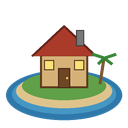
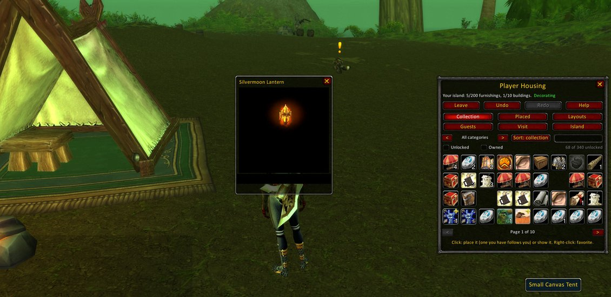
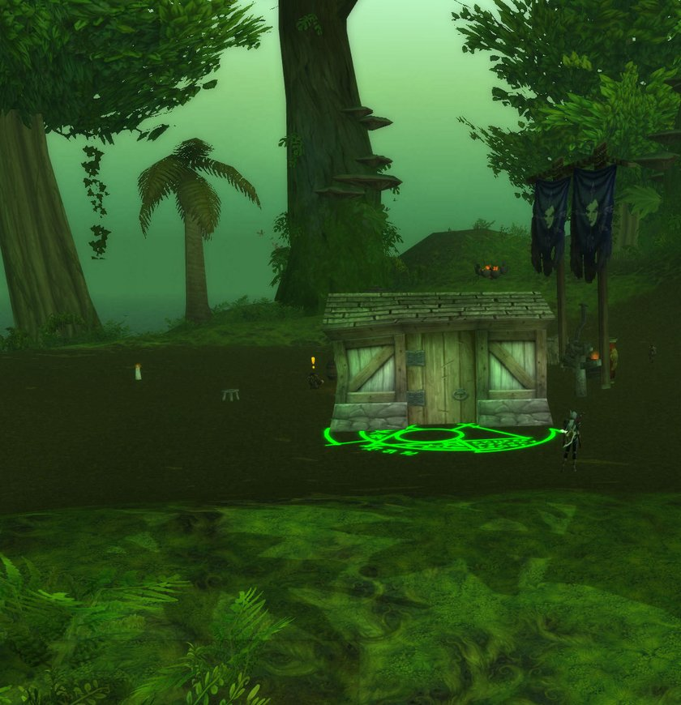
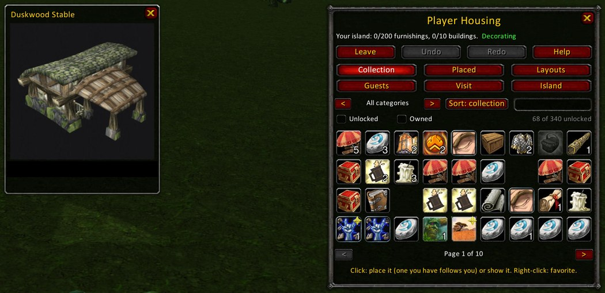

# Player Housing (mod-playerhousing)



**Author:** [dudemcbro](https://github.com/dudemcbro) | **License:** GNU AGPL v3.0 |
**Works with:** AzerothCore WotLK (3.3.5a)

Player housing for AzerothCore (WotLK 3.3.5a), modeled on Lord of the Rings Online and Final
Fantasy XIV without the neighborhoods. Every account gets one private copy of GM Island,
shared by all its characters. Click a furnishing or building in the Collection, click where
it should go, done. Every change can be undone, and anything picked up returns to the shared
Collection without taking bag space.
What you can own grows as you play: exploring, dungeons, raids, reputation, professions and
holidays all add pieces to your Collection, and buildings climb from a broken cart and a
shredded tent at level 1 to faction halls at Exalted.

<p>
  
</p>
<p>
  
  
</p>

**Features:** a private island per account; 2,350+ furnishings, buildings and figurines
unlocked by playing; placing, turning, tilting and resizing with the mouse, on floors, table
tops, walls and ceilings; undo for everything; saved layouts and sets; mannequins that wear
your real gear; weather, time of day and music per island; visitors, likes, a guestbook and
roommates; GM moderation tools.

The design and the reasoning behind it are in [docs/UX_PLAN.md](docs/UX_PLAN.md). Every
piece and what unlocks it is listed in [docs/UNLOCKS.md](docs/UNLOCKS.md). Troubleshooting: for servers in
[docs/SERVER_SETUP.md](docs/SERVER_SETUP.md#when-somethings-wrong), for players in
[docs/PLAYER_SETUP.md](docs/PLAYER_SETUP.md#if-somethings-not-right).

## Future features

- More player housing islands and areas
- Improved object controls
- Progression and people: more collectibles
- Mannequins: poses, weapons drawn or sheathed, mount and pet stands
- Guild islands

## Setting it up

- **Server admins:** [docs/SERVER_SETUP.md](docs/SERVER_SETUP.md), step by step: build the
  module, configure, apply the SQL (`tools/release/apply_sql.sh`), clear the island in the
  server data, and make the one download players need
  (`tools/release/make_player_bundle.sh`).
- **Players:** [docs/PLAYER_SETUP.md](docs/PLAYER_SETUP.md): unzip the server's
  PlayerHousing-client.zip into the game folder, start the game with
  PlayerHousingLauncher.exe, and ask Krook at any capital's inn for a House Key.
- **Trying it out:** [tools/test-server](tools/test-server/README.md) runs a complete
  server with the module in a container.

In short, a server needs AzerothCore WotLK (3.3.5a) built with the module and its map tools;
every player needs the [client addon](#client-addon) (required: it is the housing window),
the client patch (icons, see-through ghosts, the cleared island) and, recommended,
[PlayerHousing.dll](client-dll/README.md) (pieces follow the mouse). The module uses only
standard AzerothCore script hooks and needs no core patches, so stock AzerothCore should
work as well as the playerbots fork it is developed on (see
[docs/SERVER_SETUP.md](docs/SERVER_SETUP.md#what-you-need)).

## Configuration

| Setting | Default | What it does |
| --- | --- | --- |
| `PlayerHousing.Enable` | 1 | The whole module |
| `PlayerHousing.FreeMode` | 0 | Test servers: copies from the Collection are free and the House Key is instant |
| `PlayerHousing.UnlockAll` | 0 | Test servers: the whole Collection is unlocked, plus "one of everything" |
| `PlayerHousing.Layout` | cleared | `cleared` (no guild hall) or `guildhouse` |
| `PlayerHousing.DefaultPrivacy` | private | Privacy of new islands: `private`, `friends` or `public` |
| `PlayerHousing.GmBypassPrivate` | 0 | GMs in GM mode can visit any island |
| `PlayerHousing.MaxFurnishings` | 200 | Furnishings per island |
| `PlayerHousing.MaxBuildings` | 10 | Buildings per island |
| `PlayerHousing.Size.Min`, `Size.Max` | 0.5, 2 | How small and big pieces can be made (times normal size); 1 and 1 turn resizing off |
| `PlayerHousing.Tilt.Max` | 180 | How far pieces tilt each way, in degrees; 180 is all the way round (upside down and on), 0 turns tilting off |
| `PlayerHousing.SavedLayouts` | 5 | Layouts each island can keep (0 turns them off, 20 at most) |
| `PlayerHousing.Ghosts` | 1 | A piece being placed or moved follows its player as a see-through ghost (needs this version's client patch); 0 carries every piece as it is |
| `PlayerHousing.Catalog` | curated | `curated`: the pieces earned through progression. `everything`: also every other object model in the game (about 2,000), in the Collection's Catalog |
| `PlayerHousing.HouseKey.DelaySeconds` | 0 | How long "Go home" takes (0: at once); moving or combat cancels |
| `PlayerHousing.StewardEntry` | 900200 | Krook's creature entry |
| `PlayerHousing.StewardDisplayId` | 25384 | Krook's model (a Wolvar orphan) |

Every setting can also come from an environment variable, for example
`AC_PLAYER_HOUSING_FREE_MODE=1` (the core's usual `AC_` naming).
Ranges, ready-made setups and what else can be tuned are in
[docs/SERVER_SETUP.md](docs/SERVER_SETUP.md#knobs-and-dials).

## For players

### Getting started

- Find **Krook** beside the innkeeper in any capital (Stormwind, Ironforge, Darnassus, the
  Exodar, Orgrimmar, Thunder Bluff, the Undercity, Silvermoon, Shattrath and Dalaran) and
  ask for a house: he gives you a **House Key**. The first key on an account comes with a
  chair, table and lantern in the shared Collection; your other characters ask him for
  their own key and share the same island.
- Right-click the House Key (or type `.house`, or `/housing`) for the housing window. **Go
  home** takes you to your island (it needs the key). A fallen cart and a shredded tent are
  waiting.
- Lost the key? Krook has another, at any innkeeper or on your island.

### Krook's welcome tour

Krook (in every capital beside the innkeeper, and on your island) offers five short
quests that walk you through housing, each done the moment you do the thing:

1. **Home Sweet Island**: use your House Key to go home.
2. **Making It Yours**: place a furnishing.
3. **A Fresh Look**: click a piece, then turn, nudge or move it.
4. **Nothing Is Ever Lost**: undo a change.
5. **Open House**: invite a guest, or open your island to friends or everyone.

Each gives a little silver; the last unlocks **Krook's Picnic Basket**. Skipping them costs
nothing. Once the tour is done, Krook leaves your island; **Call Krook** (Island tab) brings
him back.

### Placing things

Click a piece in the Collection tab and it goes on your mouse: a see-through copy of its
model (world-model buildings show as their real, solid object). With
[PlayerHousing.dll](client-dll/README.md) it follows the mouse over the world: on the
floor, on a table top, on a wall facing out, or hanging under a ceiling. A left-click sets
it down (Shift-click: then another of the same), a right-click or Escape puts it back.
Without the DLL the game can't say where the mouse points, so it floats a couple of yards
ahead of you: walk it where it goes, the arrow keys push it about, and G sets it down. While
you hold a piece the housing window steps aside; it comes back when you set the piece down
or put it back.

Everything about the held piece is the mouse wheel with a modifier (the plain wheel still
zooms the camera): see [the table below](#client-addon). Nothing is used until it is set
down: it takes a copy you own, or buys a new unlocked copy at that moment.

You can place anywhere on your island, indoors or out, up to the beach. The only rules: it
has to be on your island, and each island holds up to 200 furnishings and 10 buildings
(both set in the config). Swim too far out and you're brought back to the beach.

### Changing things

- With the housing window open, **right-click any furnishing or building** to put it back
  on the mouse, where it can be moved, turned, tilted and resized like a new piece. What
  stands on it (a lantern on a table, the furniture in a building) comes along, and one
  undo puts it all back.
- **Several at once**: Ctrl-right-click pieces to select them, then right-click one of them
  to pick them all up together. **Save as a set** keeps them, to set down anywhere later.
- **The Placed tab** lists every piece, nearest first. Click one and it gets a green ring
  on the island, so you know which of several alike it is; Move, Go (walk to it) and Put
  away are beside it.
- **Grid** (Shift+middle-click while holding, or `.house grid 1`): pieces land on a grid.
- **Undo** and **Redo** are at the top of the window; their tooltips say what they'd undo,
  and right-clicking Undo lists the recent changes to undo back to any of them.
- Shift-right-click a held piece to put it away in the Collection.
- **Pack up all** (Island tab) returns every piece at once, and can be undone too.
- Closing the window puts everything back to normal: chairs can be sat on, mailboxes and
  crafting stations work.

### Figurines

The Collection's **Figurines**: 21 trophies, from a Kobold and Hogger to Onyxia, Illidan
and the Lich King. Each is the creature's own model, shrunk to fit on a table (about a
yard long) and frozen mid-pose. Defeat the boss to unlock it, or hold its dungeon or raid
achievement, so past victories count. Figurines go on tables like other small pieces,
resize like anything else, and don't tilt. Visitors who click one learn whose trophy it
is.

### The Bank Chest

Unlocked at level 20 (or by buying 7 bank slots). Place it anywhere, and click it when
you're not decorating: your own bank opens, right there. It works the way a banker does:
only near the chest, for a few minutes after you open it. Visitors find it locked.

### Weather, time of day and music

The Island tab. Each island keeps its own:

- **Weather**: clear, fog, light rain, rain, thunderstorm, light snow, snow, blizzard or
  sandstorm.
- **Time of day**: the server's clock, or always dawn, midday, dusk or night.
- **Music**: place a **Music Box** (unlocked at level 10) and click it to pick a tune:
  the capital cities, taverns, Dalaran, Nagrand, Grizzly Hills and more.

Everyone on the island sees and hears them, visitors included, and nobody else does.
Leaving puts back the real clock and the weather where you land.

### Saved layouts

The Layouts tab (or `.house layout`). Save your island as it is, try something new, and set
the old one back out whenever you like. Each island keeps up to 5 (set in the config).

- **Set it out** packs up the island and places the layout: every piece where it stood,
  turned, sized and tilted the same, lanterns back on their tables. It uses your own
  pieces; ones you don't have are left out, and the message says which. One undo puts the
  island back as it was.
- A layout counts what's missing and gets the ones you've unlocked in one click, and says
  how many are still locked.
- **Send a copy** to someone in your party or guild, or a friend who has you on their list.
  With **Visitors may copy my layout** ticked, anyone visiting can save a copy (Visit tab,
  Copy). Layouts hold no items: whoever sets one out places their own.
- Mannequins come back bare: their gear goes to your bags when the island is packed up.

### Mannequins: show off your gear

The Mannequin (in everyone's starter set) is a stand for armor and weapons. Place it like
any piece, then right-click it for its character sheet:

- **Drag gear** from your bags onto it (or onto a slot) to put it on; the item leaves your
  bags while it's on display, enchants and gems included. Putting something on an occupied
  slot swaps them.
- **Drag it off**, or right-click a slot, to take it back to your bags (Krook mails it to
  you if your bags are full). **Take all off** empties it.
- **Trade gear**: what the mannequin wears goes on you, and what you wear goes on it, in
  one go. Anything you can't wear goes to your bags.
- **Race**, **Man** or **Woman**, and **New look**: every playable race, with a random face,
  skin and hair a character could be made with.
- **Move** puts it on the mouse like any piece.
- Mannequins stand still in a plain standing pose (poses are planned, see
  [Future features](#future-features)).
- Visitors can click it to see what it's wearing, but can't change anything.

Rings, necklaces, trinkets and relics don't show on a body, so they aren't offered.

### The Collection

The Collection tab. It lists every piece by category with your progress, for example
"Buildings (6/49, 2 new)". Click an unlocked piece and it goes on your mouse at once (a new
copy is paid for only when you set it down, so putting it back costs nothing); its details
show how many you own and have placed, with Get 1 and Get 5 (free with FreeMode, a small
gold cost otherwise). A locked piece
tells you how to earn it, with your progress so far
("Reach level 20 (you're level 15)", "Exalted with Stormwind (you're Revered)").

- **Search by name** (or `.house collection lamp`) finds pieces in every category,
  locked ones included, so you can see what's out there.
- Pieces you've unlocked but not looked at yet are marked **(new)**, and the Collection
  counts them. Leaving the tab clears the marks.
- **Sort** by the Collection's order, name, cost, how many you own, or what unlocks them.
- **Showing all pieces / unlocked only**: hide what you haven't earned yet, for a shorter
  list of what you can place right now.
- Unlocks happen the moment you earn them, with a message.
- Things you did before the module was installed count: they unlock at your next login.
- Unlocks are shared by all your characters, except faction buildings, which need Exalted
  with their faction on the character that places them.

### Visitors

The Island and Guests tabs:

- **Privacy**: Private (only you and your guests), Friends & guild, or Public.
- **Guest list**: invite by name, your target, or your whole party. Guests can always
  visit, whatever the privacy setting. They're told when you invite them.
- **Greeting**: a message every visitor sees when they arrive.

The Visit tab lists the islands of your party, guild and friends, the ones you're invited
to, public ones and the most liked; or visit someone by name. Only islands you're allowed
into are shown, so every entry works with one click. Visitors can use chairs and stations
but can't change anything. The owner is told when someone arrives.

### Likes and the visitor log

- Visitors can **like** an island from the Visit tab (one like per account, so alts don't
  count twice), and take it back. The owner is told.
- The Visit tab's **Most liked** list shows the islands you may enter, most liked first.
- The Island tab's **Visitor log**: the last visitors with the date and time, how many
  came this week, and your likes. Coming home, Krook says how many visits there were
  since you were last there.
- **The guestbook**: visitors sign it from the Visit tab or with `.house sign <note>`, once
  a day per island (and five notes an hour per account). Coming home, you're told how many
  new notes there are; the Guests tab's second page lists them, and you can throw one out.
  The last 100 notes are kept.
- **The door**: Island tab, Door here: visitors (roommates too)
  arrive there, facing the way you faced, instead of at the landing spot, until you set it
  back.

### Roommates

The Guests tab: make a guest a **roommate** (or `.house roommate <name>`). A roommate can decorate your island with you: place their own pieces, and move,
turn, resize or pick up yours, with their own undo. What they can't do: pack up the
island, set out a layout, change your settings, or dress a mannequin that isn't theirs.

Every piece remembers who placed it and goes back to them when picked up: a roommate's
piece you pick up goes back to their Collection (and undo takes it back out), and yours
to yours. Gear on a roommate's mannequin goes back to them by mail. "Make them a
guest only" (or `.house unroommate <name>`) ends it; their pieces stay where they are.

### Commands

The window does all of this; these are shortcuts. `.krook` works the same as `.house`.

| Command | What it does |
| --- | --- |
| `.house` | Opens the housing window (the addon is needed) |
| `.house home`, `leave`, `unstuck` | Go home (needs the House Key), leave the island, back to the landing spot |
| `.house krook` | Krook comes over to you on your island |
| `.house decorate [on\|off]` | Start or stop decorating (the window does this when it opens and closes) |
| `.house undo [steps]`, `redo` | Undo the last change (or that many, up to 20), or redo |
| `.house select [id\|next\|previous]`, `list` | Select a piece by number, the nearest, or the next out; list those within 40 yards |
| `.house move [id]`, `goto <id>`, `highlight <id\|0>` | Put a piece on the mouse; walk to it; a green ring under it (0: none) |
| `.house rotate <degrees> [id]`, `face [id]`, `here [id]`, `nudge <direction> [yards] [id]` | Turn a piece, face you, move it to you, nudge it |
| `.house ghost <item>`, `ghost move [id]`, `ghost place [another]`, `ghost cancel` | A new piece on the mouse, a placed one, set it down, never mind |
| `.house size <bigger\|smaller\|normal\|percent> [id]`, `tilt <forward\|back\|left\|right\|straight> [degrees] [id]` | Resize or tilt a piece, within the server's limits |
| `.house another [id]` | One more of this piece on the mouse, with its turn, size and tilt |
| `.house row <count> [yards] [right\|left\|forward\|back] [id]` | Copies of a piece in a straight row, one undo step |
| `.house group [add\|remove <id> \| clear]`, `match <height\|turn\|line\|space>` | Several pieces at once; line them up |
| `.house set [save <name> \| place <name> \| delete <name> \| list]` | Saved sets |
| `.house layout [save <name>\|load <name>\|delete <name>\|send <name> <player>\|copy\|list]` | Saved layouts |
| `.house grid <off\|yards>` | Snap to a grid of 0.25 to 4 yards |
| `.house pickup [id] [inside]`, `packup` | Put a piece away (`inside`: with what's in a building); put everything away (undoable) |
| `.house stand <dress <item>\|undress <slot\|all>\|look <race> <male\|female>\|trade> [id]` | A mannequin's gear and look |
| `.house collection [search]`, `get <item> [count]`, `visit [name]` | Search the Collection, get copies of an unlocked piece, visit someone |
| `.house weather <name>`, `time <name>`, `music <sound id\|off>` | The island's weather, time of day and music |
| `.house invite <name\|target\|party>`, `uninvite <name>`, `roommate <name>`, `unroommate <name>` | Guests and roommates |
| `.house privacy <private\|friends\|public>`, `greeting <text\|clear>`, `door [here\|reset]` | Who can visit, what they see, where they arrive |
| `.house like`, `visitors`, `sign <note>`, `guestbook [delete <id>]`, `report <text>` | Like an island, your visitor log, the guestbook, report an island to the GMs |
| `.house data <kind>`, `addon`, `seen`, `state` | Quiet ones for the addon |

Without an id, commands act on the selected piece.

GMs also have `.house key` (a House Key), `.house unlock <item|name|all> [player]`,
`.house relock ...`, `.house unlocks [player]`, `.house add` (Krook next to you for ten
minutes) and `.house phototour <start|next|stop|item>` (see Pictures of buildings, below).

### Moderation

Players report an island with `.house report <what's wrong>`: once per account per island while the report is open.
Online GMs are told at once. GM commands:

| Command | What it does |
| --- | --- |
| `.house reports [all]` | Open reports (or the last 20 of all), newest first |
| `.house close <id>` | Close a report |
| `.house inspect <player>` | Go to anyone's island, whatever its privacy |
| `.house hide <player>`, `unhide <player>` | Close an island to all but its guest list, and take it off the public and most liked lists |
| `.house cleargreeting <player>` | Clear an island's greeting |
| `.house gmpackup <player>` | Pack up an island: every piece goes back to the Collection of whoever placed it, and mannequin gear is mailed back |

GM actions are logged to the server log (module logger).

## Client addon

`client-addon/PlayerHousing` is the housing window, and the server needs it: the House Key,
Krook and `.house` open it, and pieces are placed and moved with the mouse.

The addon sends its commands over AzerothCore's addon command channel (on unless the server
sets `AddonChannel = 0`): chat's flood limit doesn't count them, so moving a piece with the
mouse never gets anyone muted, and they don't fill the chat box. It checks the channel
answers when you log in, and sends them as chat otherwise. Nothing asks "are you sure"
before something Undo can put back; only saving over or deleting a layout or a set, and
throwing out a guestbook note, still ask.

The window has a toolbar (Go home or Leave, Undo, Redo and Help; right-click Undo for the
recent changes) and six tabs. Escape closes it.

- **Collection**: every piece there is, unlocked ones in color and locked ones grey, with
  how many you own on each icon. All, favorites, recently placed, or a category; only
  unlocked ones, or only the ones you own; search by name; sort by the Collection's order,
  name, cost, owned or unlock type. A click puts an unlocked piece on the mouse and keeps it
  in the preview beside the window with its details and Get 1 and Get 5. Hover an icon to
  preview the piece: its model, turning slowly, framed to fit. Buildings made of world
  models can't be drawn in a window, so they show a picture (see Pictures of buildings).
  Right-click a piece to star it as a favorite.
- **Placed**: the pieces on the island, nearest first, and a search. Click one for a green
  ring under it on the island; Move, Go and Put away.
- **Layouts**: save the island under a name, set a layout out again, send it, delete it.
  Its second page has sets: pieces saved together, set down anywhere from the mouse.
- **Guests**: invite by name, your target or your party; make a guest a roommate or
  remove them. Its second page is the guestbook.
- **Visit**: the islands of your party, guild and friends, the ones you're invited to,
  public ones and the most liked; or visit someone by name. On someone's island: Like, Copy
  their layout (when they allow it) and sign the guestbook.
- **Island**: privacy, greeting, weather, time of day and music (with a Music Box placed),
  the door, the visitor log, Pack up all, Unstuck and Call Krook.

In the preview, drag the model to turn it, use the mouse wheel to bring it nearer or farther
and right-drag to move it up or down; Reset puts it back. `/housing preview` says which model
it asked for and which the game loaded (for bug reports).

**Holding a piece**: a piece being placed or moved follows your mouse (with
[PlayerHousing.dll](client-dll/README.md)) or, without the DLL, floats ahead of you. Furniture
and buildings with ordinary models are see-through copies of themselves; world-model buildings
(towers, farmhouses) and tilted pieces show as the real object, so their lean shows. What stands
on a piece, or is inside a building, comes along. Turning your character turns the held piece
with you.

| Mouse or key | Does |
| --- | --- |
| Move the mouse (with the DLL) | It follows the cursor: floor, table top, a wall (facing out), under a ceiling |
| Left-click, Shift-click | Set it down; Shift: then another of the same |
| Right-click, Escape | Never mind: a new piece stays in your Collection, a moved one where it was |
| Shift+right-click | Put a moved piece away in your Collection |
| Wheel | Zoom the camera, as ever |
| Shift+wheel, Ctrl+Shift+wheel | Turn it; finely (1 degree) |
| Ctrl+wheel | Raise, lower |
| Alt+wheel, Alt+Shift+wheel | Tilt it forward or back; to its side |
| Ctrl+Alt+wheel | Bigger, smaller |
| Middle-click, Ctrl+middle-click, Shift+middle-click | Stand it straight; normal size; step the grid |
| Arrows, G, Shift+G (without the DLL) | Push it farther, nearer, sideways; set it down; and another |

While you hold a piece the window steps aside and a small panel at the bottom of the screen
shows what you're holding, its size and tilt, which way its front points, and the keys above.
The keys are bound only while you hold a piece, so the usual ones come back afterwards;
bindings can't change in combat, so they wait for it to end.

It lands on the grid when the grid is on (not on a wall), and stands on a table top it's over
(held higher, it floats). A building always stands on the ground, wherever the mouse is. The
see-through ghosts need the client patch (see [Setting it up](#setting-it-up)) from this
version: without it they can't be seen, and `PlayerHousing.Ghosts = 0` carries every piece as
it is instead.

The window opens by itself when you arrive home (`/housing auto` turns that off).
`/housing` shows or hides it, and `/housing <command>` runs any `.house` command. A button
on the minimap's edge opens the window; drag it around the edge, or `/housing minimap` to
hide it. Key bindings: Key Bindings, Player Housing.

Install: copy the `PlayerHousing` folder into `World of Warcraft/Interface/AddOns/`. The
window can't open or close, or change tabs, in combat (a WoW rule for windows with item
buttons).

The addon talks to the server with the same `.house` commands, and reads what the server
whispers to the player with the addon prefix `HOUSING`: the island state
(`PlayerHousingMgr::SendAddonState`) and the tabs' lists (`src/HousingAddon.cpp`: `begin`,
a `row` a message, `end`). The piece list with names, icons and unlock hints
(`PieceInfo.lua`) comes from the content builder. `client-addon/test/harness.lua` runs the
addon outside the game against stubbed WoW functions:

```
lua5.1 client-addon/test/harness.lua $(sed -n 's|^\([A-Za-z]*\.lua\)$|client-addon/PlayerHousing/\1|p' \
    client-addon/PlayerHousing/PlayerHousing.toc)
```

### Pictures of buildings

A model window can't draw buildings made of world models, so the addon comes with a
picture of each (`Pictures/<item>.tga`, listed in `Pictures.lua`), and shows a floor plan to
scale for any building without one. `tools/pictures/render_buildings.py` makes them: it
downloads each building's model files and textures (from wago.tools, which serves the
game's files) and draws them all from the same three-quarter view. Run it again after adding
buildings (it needs numpy and Pillow: `apt install python3-numpy python3-pil`).

Pictures from your own client instead, with the game's own lighting, take a GM a few minutes:

1. As a GM, go home and type `/housing phototour`. The island turns clear and sunny, the
   camera goes to first person, and each building is set up in front of you in turn: the
   interface hides for a moment while the addon takes a screenshot. Leave the mouse and keys
   alone until it says it's done (`/housing phototour stop` ends it early).
2. Log out (or `/reload`), so the addon saves which screenshot shows which building.
3. Run `tools/pictures/make_pictures.py --wow "<your client folder>"` (it needs Pillow:
   `apt install python3-pil`). It cuts a square from the middle of each screenshot, writes
   `Interface/AddOns/PlayerHousing/Pictures/<item>.tga` and lists them in `Pictures.lua`.
4. `/reload`: buildings show their pictures.

Copying a new version of the addon over the old one brings back the rendered pictures: run
the script again (it only needs a moment) to use yours.

## Content

The pieces, their models and what unlocks them are written as a Python list in
`tools/content/pieces.py`. `tools/content/build_content.py` turns it into
`sql/db_world/base/mod_playerhousing_world_content.sql` (items, objects, pieces and rules), `docs/UNLOCKS.md`, the addon's model list
(`client-addon/PlayerHousing/PieceModels.lua`) and the items the client patch adds
(`tools/gm-island-cleared/client_items.tsv`). Each item's bag icon is picked from its name
by `tools/content/icons.py` (a piece's `icon` field overrides it). It reads the world
database (to copy models and behavior from existing objects) and the client data's `dbc`
folder (for model sizes, names and icons):

```
python3 tools/content/build_content.py --dbc /path/to/data/dbc \
    --mysql "mysql -uacore -pacore acore_world"
```

The builder also writes `sql/db_world/base/mod_playerhousing_world_catalog.sql`: every
other object model in the game (about 2,000), one piece each, named after its object (or
its model when the object's name is an internal one), sized from the game data, and
marked as fitting on tables when small. Big models (whole areas, ships), collision shapes
and markers are left out. These pieces are used only with `PlayerHousing.Catalog =
everything`: then everyone has them from the start, in the Collection's Catalog (search it
by name). The file uses its own item and object ranges (items 940000 and up), so the
curated content and the catalog never step on each other, and applying it with `curated`
does nothing visible.

Rules in `mod_playerhousing_piece_rule`: level, achievement, reputation rank, quest, kill,
exploring an area, skill level, or never (GM and UnlockAll only). Rules in the same group
must all be met; any complete group unlocks the piece. Achievements come first wherever one
fits, since players already see and track those.

## How it works

- **One island per account.** Every character on an account shares it
  (`mod_playerhousing_account` names the character it's kept under). GM Island (Kalimdor) is
  shared by everyone, and phasing gives each account a private copy. A house phase has bit 31 set and bit 0 clear, and the
  module turns off the core's "any shared bit" phase matching for it
  (`GLOBALHOOK_ON_BEFORE_WORLDOBJECT_SET_PHASEMASK`), so each phase value is its own ID.
  The owner's guests share the owner's phase.
- An island's pieces are spawned when the first person arrives and removed when the last
  one leaves. Anyone found on the island without going through the House Key (other than
  GMs) is sent back where they came from. Logging out on your own island logs you back in
  there; logging out on someone else's brings you back where you came from.
- **Pieces.** Each piece has an item entry (901100 to 901199 and 902001 to 902999; the House
  Key is 902000) for its name and icon, but what a player owns is a count in the Collection
  (`mod_playerhousing_storage`), not a bag item. Its object is `910000 + (item - 900000)`
  normally, and `920000 + (item - 900000)` while decorating: a clickable copy of chairs and
  stations, so a right-click picks the piece up instead of using it (world-model buildings
  have none and are picked up from the Placed tab). Buildings stay visible from farther away.
  Housing objects have server-side collision turned off.
- **Sizes and outlines** come from the game data: small models from
  `GameObjectDisplayInfo.dbc`, buildings made of world models from the server's collision
  data (`vmaps/GameObjectModels.dtree`). A building's outline, turned the way it faces, is
  what counts as inside it when picking it up with what's inside.
- **Placement** follows the mouse: with PlayerHousing.dll the addon asks the game where the
  mouse points and which way the surface there faces, and sends it to the server
  (`.house ghost at x y z [nx ny nz]`). The server decides where the piece goes (a table
  top, a wall, a ceiling, the ground under a building) and tells the addon, which moves the
  ghost itself between the server's updates.
- **Ghosts** (`src/HousingGhosts.cpp`) follow the player's position, guessed ahead of their
  last movement packet (the client reports only every half second when running straight),
  and are redrawn every tenth of a second. Furniture's ghost is a creature (entry 900203)
  with a see-through model of the piece: a `CreatureModelData` and `CreatureDisplayInfo` row
  per piece model (display 60000 plus the item's offset from 900000, opacity 150), which
  the content builder writes for the server (`creaturemodeldata_dbc`,
  `creaturedisplayinfo_dbc`) and the client patch adds to the client. It glides with a
  movement spline, its facing held. Figurines and the mannequin get a see-through copy of
  their creature's display. A building's ghost is a see-through block: a model the client
  patch writes for each building (`tools/gm-island-cleared/make_ghost_blocks.py`, a box from
  the building's outline and height, with one shared texture), under the same display
  numbers. Pieces whose model has no ghost are carried as game objects, put down again in the
  new spot at most four times a second. With PlayerHousing.dll the addon sends where the
  mouse points (`.house ghost at x y z [facing]`) up to ten times a second over AzerothCore's
  addon command channel (prefix `AzerothCore`), which chat's flood limit doesn't count and
  which answers the addon rather than the chat window; the server keeps its own limit of 25
  a second. The ghost then shows at that point instead of ahead of the player: on the table
  top there when the point is on one, and turned to face out when the surface there is a
  wall. A point on one of the pieces being moved (still standing where it was) counts as
  what that stands on.
- **Undo** keeps each change as the before and after of the pieces it touched, so undo and
  redo replay them exactly, handing items back or taking them as needed. Each player has
  their own list, in memory, cleared when they leave the island. A step only applies to
  the very pieces it was written for (see Safety and limits).
- **Mannequins** are creatures (entry 900201) with the mirror image flag, frozen still, the way the
  Mirror Image spell works: the client asks what the figure wears and the module answers
  (a `ServerScript` catching `CMSG_GET_MIRRORIMAGE_DATA`), while weapons are virtual items.
  Gear on a stand leaves the inventory but stays in `item_instance`, the way mail keeps
  items, with a row in `mod_playerhousing_placement_gear`; so enchants, gems and the item's
  guid survive, and undo returns the same item. Race, gender and features (skin, face,
  hair, hair color, facial hair) are packed into the placement's `look`. Deleting a character for good deletes
  its own stand gear; gear roommates left on its island is mailed back to them first.
  The characters rollback mails any gear still on stands back to its owners.

### Safety and limits

Nothing on an island can be duplicated or lost:

- Every piece placed takes one from the Collection's count, and every piece picked up gives
  one back.
- An undo or redo step only applies to the pieces it was written for. If someone else has
  since picked one up or replaced it, the step is dropped with a message. Placement ids
  are never handed out twice while anyone is on the island, and a GM packing up an island
  or its owner being deleted clears every undo list that points at it.
- Gear on a mannequin is only ever changed by the player it belongs to; anyone else's undo
  moves the stand and leaves what it wears alone.
- When a character is deleted, pieces roommates placed on its island go back to the
  roommates' Collections and their mannequin gear comes by mail. If it was the character
  the account's island was kept under, the island moves to another character on the account. The island itself stays until the
  character is gone for good, so a GM can still restore it; it goes when the core removes
  the character (also when the core purges old deleted characters), and anything left by
  characters removed while the module was off is cleaned up at the next start. Deleted
  characters' islands drop off the visit lists and can't be visited.

Limits, per player (GMs are exempt from the first):

- 15 housing commands or menu clicks in any 3 seconds.
- 3 seconds between heavy actions: pack up, set out a layout, get the missing pieces, one of
  everything, and undoing or redoing a step of more than 20 pieces.
- 1 second between weather, time of day and music changes, which everyone on the island
  receives.
- A like every 10 seconds, and one message of each kind a minute from one player to the
  same other player (an invite, roommate news, a like, a guestbook note). Five reports an
  hour per account; guestbook notes as above.

Player text (greetings, layout names, set names, guestbook notes, reports) is escaped for SQL, stripped of control
characters and link codes, and cut to length without splitting a character. `nan` and `inf`
aren't accepted as numbers. Players who aren't on an island cost the module one check per
update, without taking its lock, and the visit lists look up guests and friends once per
list rather than once per island.

### Load

`tools/test-server/testclient/load_test.py` puts many players on their islands at once:
each goes home, opens the island, places pieces, turns, nudges, undoes and redoes, and
visits a neighbor, while a GM samples the server's update times. On the development
container (server and all the clients on one machine):

| Players | Pieces placed | Place, p95 | Undo, p95 | Visit, p95 | Go home, p95 | Server update: mean, p99, max |
| --- | --- | --- | --- | --- | --- | --- |
| 40 | 320 in 37 s | 127 ms | 129 ms | 547 ms | 78 ms | 11 ms, 105 ms, 1244 ms |
| 99 | 792 in 42 s | 168 ms | 134 ms | 549 ms | 92 ms | 14 ms, 150 ms, 223 ms |

Going home is a teleport to another continent, every player at the same moment; a visit
is a short hop on the island. "Go home" is measured by one more player in a process of its
own, going home and back all through the test: the load test's own players share one
Python process, and reading all their arrivals at once takes it seconds (their own
figure, 5.6 s at 99 players, is the test client, not the server). The 1.2 s update at 40
players came in the first run after a restart. The worldserver used about 1.8 GB.

No island showed another island's pieces, and no action failed.

Then with everyone at home and their pieces out (`--hold 60`; `--walk` has them run in
circles, as players moving about do):

| Islands open | Pieces out | Players | Server update: mean, p99 |
| --- | --- | --- | --- |
| none | 0 | | 8 ms, 39 ms |
| 100 | 2000 | standing | 8 ms, 53 ms |
| 100 | 2000 | running about | 9 ms, 56 ms |
| 50 | 3000 | running about | 9 ms, 51 ms |
| 100 | 6000 | standing | 8 ms, 51 ms |
| 100 | 6000 | running about | 19 ms, 195 ms |

Placing those 6000 pieces (100 players at once, as fast as the test can click) ran at
29 ms mean, 424 ms p99.

### Thousands of players

Every island is at the same spot on the same map (GM Island, on Kalimdor), told apart
only by phase. That is cheap at the sizes above, and what limits it past them:

- All open islands share one map thread, the one that also runs the rest of Kalimdor.
  `MapUpdate.Threads` can't spread them.
- Pieces left out cost next to nothing while their owners stand still. But whenever a
  player moves, the server looks again at everything within sight to decide what to show,
  and that includes every other island's pieces: hidden by phase, but still looked at. In a
  profile of the 100 island, 6000 piece run, about half the map thread was there
  (`PlayerRelocationNotifier`). The cost grows with the players moving about at home
  times the pieces out on all islands.
- Housing commands run on the world thread, one after another, and most do a few
  database reads and writes while they wait.

A rough extrapolation from the one cost that grows: 300 islands of 60 pieces each (a few
thousand players online, 10% of them at home) is about 9 times the 6000 piece run, around
100 ms more a tick for everyone on Kalimdor; 1000 islands open is past what one map
thread can do. The fix is islands as instances: a map of their own (a Map.dbc row and a
WDT listing GM Island's tiles, added to the client patch, with the server's maps, vmaps
and mmaps extracted for it), so each island only looks at its own pieces and islands
update in parallel. Until then, a lower `PlayerHousing.MaxFurnishings` keeps the cost
down on busy servers.

## Testing

[tools/test-server](tools/test-server/README.md) has a prebuilt server image, a fast
development container and an end-to-end test that plays the whole thing through with
headless clients (`collection_smoke.py`, 96 checks: House Keys from Krook, the Collection,
placing on the mouse, walls and ceilings, undo, several pieces at once, sets, buildings,
mannequins and trading gear, layouts, the Placed ring, visitors, one island per account,
relogging), the addon harness, and a load test.

## Updating

```sh
cd <azerothcore>/modules/mod-playerhousing
git pull
```

Then rebuild, run `tools/release/apply_sql.sh` again with the worldserver stopped, and start
it. When the addon, the DLL or the content changed, build the player zip again
(`tools/release/make_player_bundle.sh`) and have players install it over the old one. The
full steps are in [docs/SERVER_SETUP.md](docs/SERVER_SETUP.md#updating).

The repository's history was rewritten in September 2026. A clone from before that
cannot pull: clone it again, or run `git fetch && git reset --hard origin/main` (this
discards local commits).

### From the house levels version

Older versions had house styles, stages, a vendor catalog and furniture unlocks. Applying
the world SQL removes those tables. At the next startup the module converts what players
had: placed furniture and catalog unlocks become Collection unlocks and counts, and with the
cleared island, anything that stood inside the old guild hall goes back to its owner's
Collection with a message on their next visit. Gold spent on stages isn't refunded.

## Uninstall

With the worldserver stopped (the characters rollback hands out mail ids), from the
module directory:

```sh
cd <azerothcore>/modules/mod-playerhousing
mysql -u <user> -p acore_world < sql/db_world/base/mod_playerhousing_world_rollback.sql
mysql -u <user> -p acore_characters < sql/db_characters/base/mod_playerhousing_characters_rollback.sql
```

They remove everything the module added; gear still on mannequins is mailed back to its
owners. On the cleared layout, put the guild hall back in the server data with
`tools/gm-island-cleared/server_data.sh --restore` (see its
[README](tools/gm-island-cleared/README.md)). Then delete the module directory and your
server's `etc/modules/mod_playerhousing.conf`, re-run CMake and rebuild. Players can
remove the client patch and the addon.

## Contributing

Issues and pull requests are welcome. Work on a feature branch and open the pull request
against `main`. Commit messages follow
[Conventional Commits](https://www.conventionalcommits.org/) (`fix: ...`, `feat: ...`,
`docs: ...`). Run the end-to-end test from [tools/test-server](tools/test-server/README.md)
(and `client-addon/test/harness.lua` for addon changes) before opening a pull request.
Content changes go in `tools/content/pieces.py`; regenerate the SQL, `docs/UNLOCKS.md`
and the addon lists with `tools/content/build_content.py` rather than editing them by hand.

## How this was made

Player Housing is designed and directed by [dudemcbro](https://github.com/dudemcbro) and
written largely with AI coding assistants: Anthropic's Claude, through Claude Code. Commits
made with it carry a `Co-Authored-By` line naming the model. Every change is checked by
the end-to-end test and the addon harness in this repository, and the module runs on a live
server where it is played and tried in the game.

## License

GNU Affero General Public License v3.0: see [LICENSE](LICENSE). The bundled
[MinHook](client-dll/minhook/LICENSE.txt) sources keep their own BSD license.
